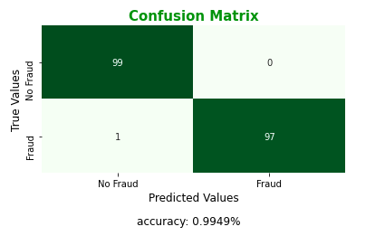

# **Fraud Detection**
---

In this project I am going to work on [credit card dataset](https://www.kaggle.com/jsreddy79/fraud-detection) available in Kaggle. The objective is reach a deep understanding of the data and compare the performance of three predictive models on the dataset. 

I decide to use this particular dataset because I like finance problems. I have found them very interesting and challenging. Otherwise, this dataset has some atributes that made it very special (e.g: we have no clues of the meaning of its variables except for three of them).

You can find two notebooks in the ***fraud-detection*** repo.

**1. EDA.ipynb**   
**2. Models.ipynb**

## EDA (Exploratory Data Analysis)
---

In this notebook I did some data analysis that you will found very fascinating. Descriptive analysis has been covered by the following items:

- Dataset shape
- Columns' data types
- Looking for null/nan values
- Describing the columns (mean, standard desviation, max value, min value, etc) 
- Is a balanced dataset?
- 'Amount' distribution
- 'Amount' vs 'Class'
- 'Amount' vs 'Time' vs 'Class'
- Variables correlation

As a EDA result I am able to say that It is a *classification problem*: I have to tag if a transaction is a fraudulent transaction or not. Also, I need to make some treatment on the dataset before training a model from it.

## Models 
---

Here I choose three classification predictive models in order to compare their performance. The chosen were:

- Logistic Regression
- SVM (Support Vector Machine)
- Random Forest Classifier

For each of them I will show their: classification report, confusion matrix and accuracy score. But I am going to decide which one is better evaluating the last two.

What I am gonna do when I find best model? I am gonna use GridSearchCV for hyperparameter tuning and you will see how I reached this:

 

Take a look at the **Models.ipynb** notebook to know which is the best model.  

---

*If you wanna make some comments/questions, tell me some advices or just give me your review of this project, please feel free to do it, that is going to be very helpful to me.*

**Thanks!**